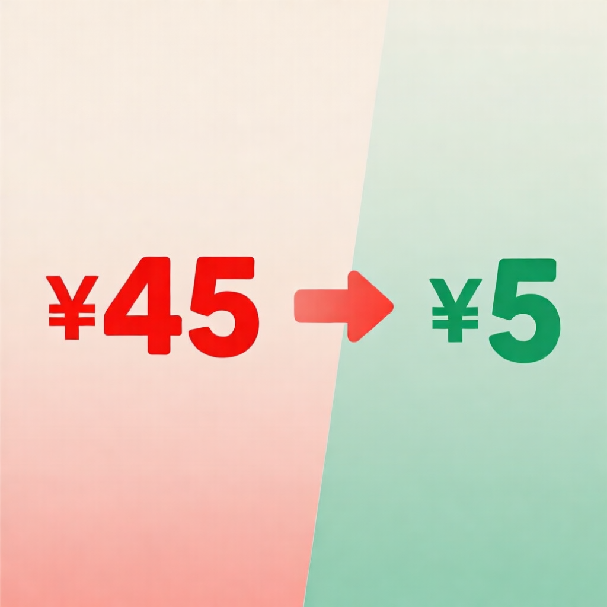

# API费用从45降到5块，我只做了一件事

> 前天一看DeepSeek账单，心凉了半截——一天干进去40多块。平时才5块多。

先说背景。我搭了一套AI助手系统，日常对话、写文章、做研究、跑数据分析，全靠大模型API撑着。之前一直直连DeepSeek，用了大半年，稳定，没出过幺蛾子。

但前天一查余额，40多没了。正常一天就5块。

怎么回事？查了日志——是我自己搞的。那两天一直在Web UI上做PPT、评估网站、研究工具，每次对话历史很长，10万tokens起步，反复调用。API费用就这么堆起来了。

然后我就做了件事——换平台。

---

## 我不是换模型，是换了平台

还是同一个模型——DeepSeek-V4-Flash，效果没变，回复质量一样。只是从直连DeepSeek换到了**硅基流动（SiliconFlow）**。

差别在哪？

**DeepSeek直连的价格：**
- 输入：¥2/百万tokens（缓存命中¥0.5）
- 输出：¥8/百万tokens

**SiliconFlow走DeepSeek-V4-Flash：**
- 输入：¥1/百万tokens
- 输出：¥1/百万tokens

输出价格从8块降到1块，直接打八折？不对，是12.5%。

质问我用同一套系统、同一个人、同一批操作——费用从45降到5块。不是省了20%，是省了80%多。

---

## 为什么能差这么多？

大模型API的计费分两块：输入（你发给模型的文字）和输出（模型回复的文字）。

大多数人的问题是：**输入才是真正的开销大户。**

一次深度对话，输入可能10万tokens，输出才几百。按DeepSeek直连算，输入要¥20（非缓存），输出不到¥1。但如果平台本身定价合理，输入+输出都便宜，那差距就出来了。

SiliconFlow的定价策略就是：输入¥1/M，输出¥1/M，统一价。不管缓存还是非缓存，都这个价。简洁明了。

---

## 踩过的坑

顺便说一句，我之前贪便宜搞了好几层备用方案——又是买第三方API Key，又是配自动切换。结果DeepSeek没钱了，哪个都没顶上，白设了。

现在方案很简单：

**主用：SiliconFlow（便宜）**
→ 如果挂了，自动切回DeepSeek直连（兜底）

没有花里胡哨的配置，就两条路。平时几乎一直在走SiliconFlow。

---

## 不是说DeepSeek不好

得说清楚：DeepSeek的模型是真的好用，V4-Flash又快又稳，我一直在用。只是接入渠道不一样，成本天差地别。

就像同样的菜，楼下小馆子和五星级酒店价格能差好几倍。菜还是那个菜。

而且SiliconFlow上可选的模型很多：DeepSeek全系列、Qwen系列、Kimi等等。以后想换模型，不用改代码，直接在后台切换就行。

---

## 所以如果你的API账单也开始高了

可以看看自己的实际用量。如果一天消耗也在几万到几十万tokens，换一个平台就能省一大截。

**具体操作就三步：**
1. 去SiliconFlow注册账号（cloud.siliconflow.cn）
2. 创建API Key，把代码里的base_url换成 https://api.siliconflow.cn/v1
3. 选个你常用的模型（DeepSeek-V4-Flash、Qwen3.5、Kimi都行）

5分钟搞定。

顺便说一下，上面这是我的邀请链接，点进去注册你和我都能得免费额度，不亏：https://cloud.siliconflow.cn/i/hlmShoGj

---

## 一点总结

AI工具不是越贵越好，重点是用得值。同样的模型，换个接入方式就能省一大笔。花5分钟看一下自己的API账单，可能就有意外收获。

> 关注「互联网之蒲公英」，持续分享AI工具和效率方法。每天一个能用的技巧，帮你少花钱、多办事。

---

*推荐码：hlmShoGj（注册时输入，双方都得免费额度）*
