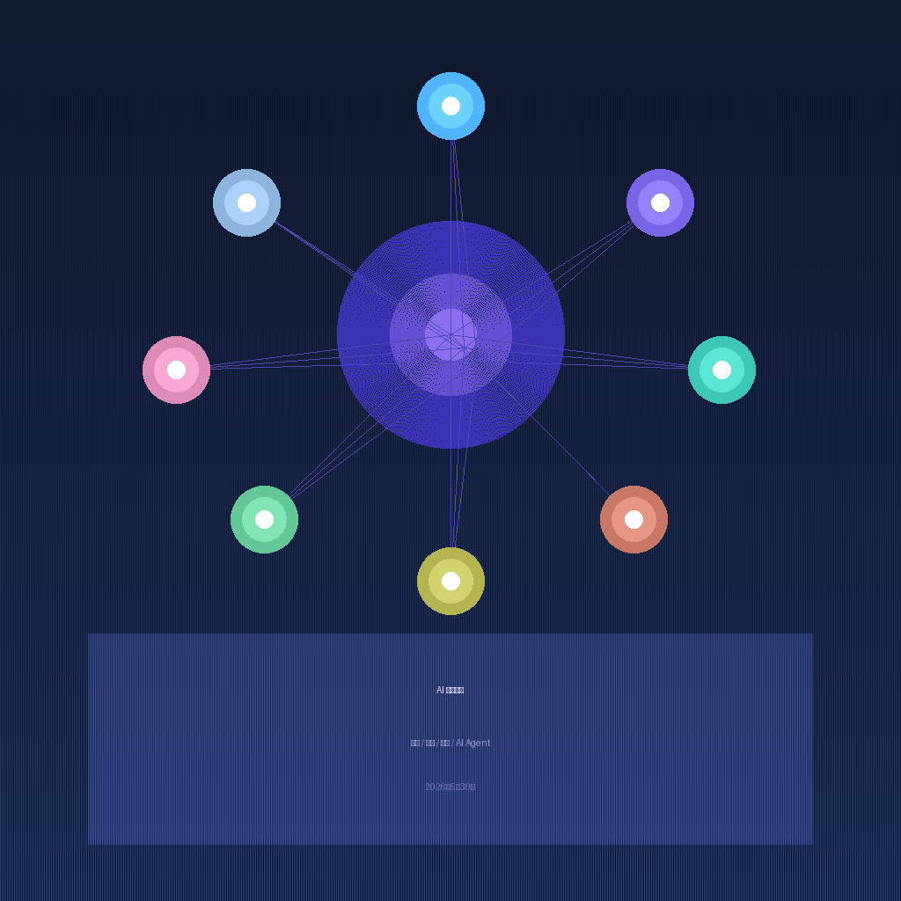

# 2026-05-30 AI工具日报

> 本期内容整理自某海外科技社区近日的高赞讨论，聚焦 AI 编程、效率工具和信息获取的最新趋势。

---

## 一、字节 TRAE 发布 AI 编程 Agent Skills Top 10 榜单

最近，字节跳动旗下 AI 编程工具 TRAE 团队发布了一份《2026 企业级 AI 编程实践手册》，其中首次公开了他们内部沉淀的 **Agent Skills Top 10** 榜单。这是目前我看到的第一份由大厂公开整理的 AI 编程 Skill 推荐清单，社区反响非常热烈。

TRAE 是基于豆包 Seed 2.0 Code 模型打造的企业级 AI 编程工具，目标不只是"代码补全"，而是让 AI 真正参与完整的软件开发流程：拆解需求、任务规划、编写代码、测试、部署。

### Top 10 Skills 榜单

| 排名 | Skill 名称 | 说明 |
|------|-----------|------|
| 1 | **frontend-design** | 前端设计 — 解决 AI 默认审美（紫渐变+圆角卡片）问题 |
| 2 | **cache-components** | 组件缓存 — 复用已有组件，减少 token 消耗 |
| 3 | **fullstack-developer** | 全栈开发 — 同时考虑前后端协作与数据流转 |
| 4 | **frontend-code-review** | 前端代码审查 |
| 5 | **code-reviewer** | 通用代码审查 |
| 6 | **webapp-testing** | Web 应用测试 |
| 7 | **pr-creator** | 自动创建 PR |
| 8 | **fix** | Bug 修复 |
| 9 | **update-docs** | 文档同步更新 |
| 10 | **find-skills** | 元技能 — AI 自动寻找所需技能 |

**核心看点：** Top 5 中有两个 Review 类 Skill，加上一个 Testing Skill，说明字节对 AI 编程的核心思路是：**代码产出速度不是核心，代码质量才是核心。** 这与 SkillsBench 论文的结论一致——好的 Skills 可以让 Agent 效果提升 51%，差的 Skills 反而会带来 39% 的负向影响。

> 如果你在用 Claude Code 或 Cursor，这份清单可以直接作为 Agent 配置的参考思路。

---

## 二、DeepSeek V4 发布：1M 超长上下文，免费接入主流工具

DeepSeek V4 Flash 和 Pro 模型正式发布，性价比极高，尤其是 **1M 的超长上下文窗口**，处理大型项目非常实用。社区已经整理出了接入各大主流工具的手把手教程。

### 接入方式一览

- **Cowork（桌面 Agent 工具）**：开启 Developer 模式 → 配置第三方推理 → 填入 DeepSeek 兼容地址和 API Key → 添加模型并打开「1M 上下文」开关
- **Claude Code（CLI 工具）**：使用 cc-switch 图形化配置 → 主模型填入 `deepseek-v4-pro[1m]`（注意要加 [1m] 后缀）
- **Cline（VS Code 插件）**：API Provider 选 OpenAI Compatible → 填入 Base URL → 手动将 Context Window 改为 1048576（即 1M）
- **Hermes / OpenCode / OpenClaw**：同样支持一键切换

**使用建议：** V4 Flash 适合快速查询和简单任务（便宜又快），V4 Pro 适合复杂编程和长文档分析（配合 1M 上下文）。

---

## 三、精选 AI 信息源推荐：每周高效获取前沿动态

如果你每周时间有限，但又不想错过前沿 AI 信息，博主「向阳乔木」分享了三个经过长期验证的高质量信息源：

### 1. Ben's Bites（AI Newsletter）
每周 AI 热点和 AI 工具大盘点，更新非常稳定，已经运营三年以上。沉浸式翻译原作者 Owen 推荐的信息源，涵盖面广，适合想快速了解每周要闻的读者。

### 2. HuggingFace Papers 热门论文榜单
AI 大神 AK 加入 HuggingFace 后打造的论文 Digg 榜，依靠社区人工投票筛选出每日、每周、每月最热的 AI 论文。质量极高，避免被信息噪音淹没。

### 3. Readwise Wise Reads
著名阅读工具 Readwise 的精选周报，除了 AI 相关内容外，还有行业大牛的文章推荐和好书推荐，帮你打破信息茧房。

---

## 写在最后

今天的 AI 工具圈依然热闹——大厂在总结最佳实践，新模型在突破上下文限制，高质量信息源在持续输出价值。不管是程序员还是普通用户，找到适合自己的工具和信息渠道，才能真正把 AI 变成生产力。

---

> 关注「互联网之蒲公英」，持续分享 AI 工具和效率方法。如果觉得有用，点个在看，让更多人看到。
