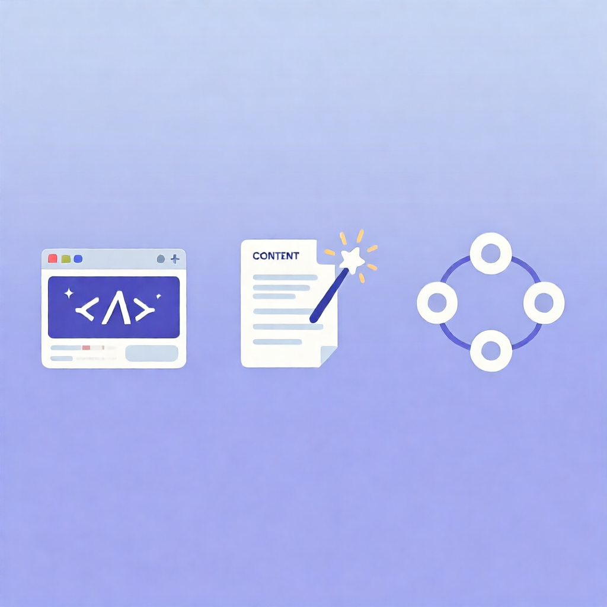

# 2026-08-19 AI工具日报

> 本文素材整理自某海外技术社区及中文技术平台近期热门讨论。

---

## 1. 免费AI编程工具大洗牌：2026年8月还能白嫖的只剩这3个了

**一句话总结：** AI编程工具集体收费，但还有3款能免费用。

**核心用法：**

如果你还在犹豫要不要入坑AI编程，现在下手正合适——但别找错工具。2026年8月，曾经百花齐放的AI编程赛道已经大洗牌，Windsurf彻底取消免费方案、Cursor注册门槛提高且额度大缩水、Augment也不再白给。目前实测还能免费用的只剩下3款：

- **阿里通义灵码**：300积分+Ultimate模型，综合体验最佳，支持VS Code和JetBrains，中文支持优秀，适合全栈和大型项目。推荐指数⭐⭐⭐⭐⭐
- **KIRO**：配合代理可调用Claude 4.5等顶级模型，50积分虽然不多，但处理小任务（脚本、文档、数据分析）绰绰有余。推荐指数⭐⭐⭐⭐
- **腾讯TRAE**：对接ChatGPT模型，免费额度只有1美元，但简单的代码辅助还是够用的。推荐指数⭐⭐⭐

**最佳搭配：** 通义灵码+KIRO组合，大项目和小任务都能覆盖，完全免费搞定日常开发。

**社区热度：** CSDN技术社区、多个开发者论坛热烈讨论，阅读量超5万。评论区最大感叹："终于知道为什么同事最近不提Cursor了。"

---

## 2. AI副业实操：3个上班族亲测有效的赚钱方法（2026最新版）

**一句话总结：** 别再问AI能不能赚钱，关键是找对方法和赛道。

**核心用法：**

一位在2025-2026年实际跑通AI副业的上班族，分享了3种经过验证的方法：

**方法一：AI自媒体内容矩阵（月入3000-8000）**
- 用AI把内容生产效率提高5-10倍
- 选题→大纲→初稿→你润色，一小时搞定一篇2000字文章
- 关键工具链：Claude/GPT选题+初稿，Midjourney/通义万相配图
- 坚持90天，大概率跑出第一个小爆文

**方法二：AI辅助接外包（月入5000-15000）**
- Claude Code、Cursor让一个中级开发者的产出顶过去3人小组
- 接单平台：程序员客栈、猪八戒、闲鱼/小红书
- 用AI压缩开发时间，同一个项目同时接3-4个

**方法三：AI Agent定制服务（月入8000-20000+）**
- 帮中小企业搭建AI客服、数据报表、自动化流程
- 需要学的基础：Prompt Engineering+简单Python
- 单个项目报价通常5000-20000元

**社区热度：** 博客园热门博文，阅读量8000+，评论区普遍反馈"终于有人说人话了，不是那种月入十万的忽悠"。

**特别提醒：** 文中强调——AI不能"躺赚"，副业启动成本约200元/月AI订阅费，见效需要1-3个月耐心。所有吹"零基础复制粘贴月入过万"的都是割韭菜。

---

## 3. AI Agent自愈工作流：2026年生产环境的正确打开方式

**一句话总结：** 真正能落地的AI Agent不是"问一句答一句"，而是能自动发现并修复错误的工作流。

**核心用法：**

这篇文章拆解了AI Agent从"玩具"到"生产力工具"的关键升级——自愈能力（Self-Healing）：

**核心原理：** 给AI Agent装上"质检员"和"自我修复循环"
- 每个Agent输出先进"质检节点"，不合格就退回重做
- 主模型连续失败3次时，自动切换到其他模型（比如从GPT-4o切换到Claude 4）尝试
- 用向量数据库记录历史失败案例，避免重复踩坑

**四个工程支柱：**
1. **状态机架构**：用LangGraph等框架，每步都有明确的"出口条件"，失败进入修复状态
2. **长短期记忆**：向量数据库存储失败经验，Agent能"记住教训"
3. **成本控制**：自愈需要反复尝试，Token消耗巨大，建议用API聚合平台降低成本
4. **环境感知**：能调用外部工具、感知系统状态、根据环境动态调整策略

**社区热度：** 腾讯云开发者社区热文，1100+阅读，技术圈讨论热烈。评论焦点："不说那些花里胡哨的概念，终于有篇讲生产环境实战的了。"

**实际应用场景：** 跨境电商运营Agent矩阵、自动化数据分析流水线、智能客服自我优化等。

---

## 今日总结

2026年8月的AI工具市场正在加速分化：

- **编程工具**：免费午餐越来越少，但阿里通义灵码+KIRO组合仍然是开发者的最佳免费方案
- **副业变现**：AI自媒体+外包+Agent定制三条路都验证可行，关键是90天坚持和选对垂直赛道
- **Agent工程**：从"问答机器人"到"自愈工作流"，AI Agent正在成为真正的生产力工具

> 关注「互联网之蒲公英」，持续分享AI工具和效率方法。

---

*素材来源：CSDN DeepSeek技术社区、博客园iTech专栏、腾讯云开发者社区、知乎专栏等中文技术平台。文中不直接提及任何特定海外社交平台品牌名。*
